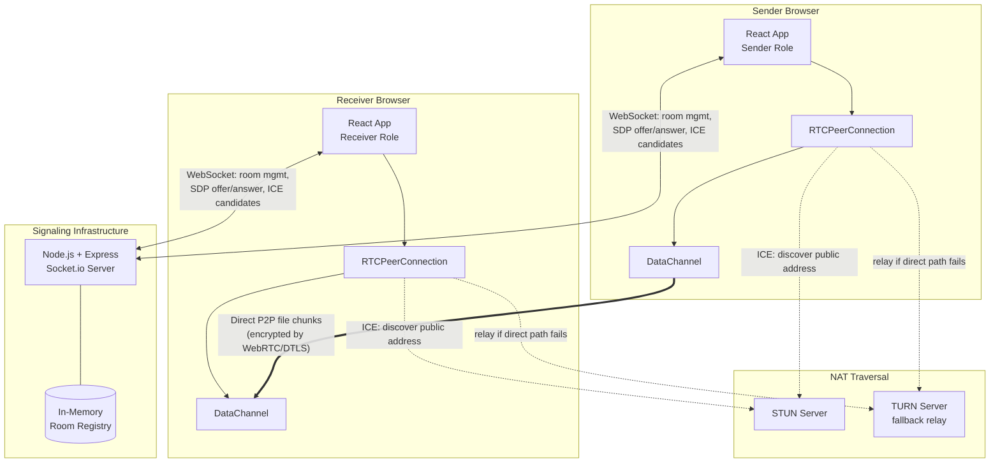
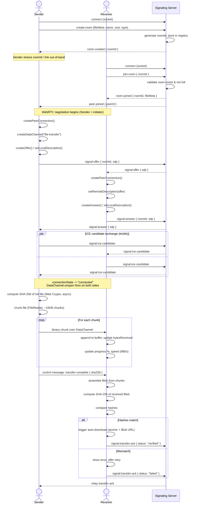
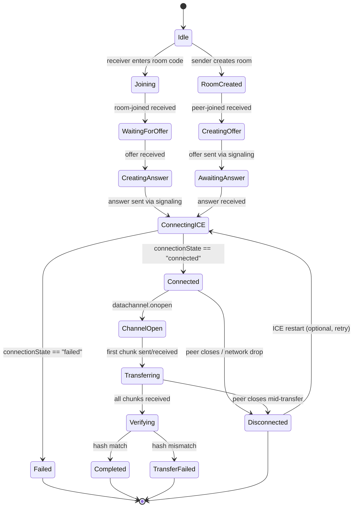
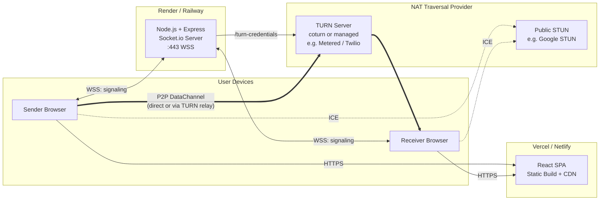

# P2P Web Share — Architecture & Design Document

**Project:** Direct Browser-to-Browser File Transfer (MARS Open Projects 2026)
**Document type:** Pre-implementation system design
**Scope:** Core MVP (1-to-1 transfer) with extension points for brownie-point features

---

## 1. High-Level Architecture

The system is composed of three logical layers that map cleanly onto the "no central file server" requirement.

| Layer | Responsibility | Lives where |
|---|---|---|
| Presentation / Application | UI, file selection, chunking, hashing, progress/state display | React SPA (sender + receiver, same codebase) |
| Signaling & Coordination | Room creation/joining, SDP offer/answer relay, ICE candidate relay, presence/disconnect events | Node.js + Express + Socket.io server |
| Transport | Actual file bytes, sent peer-to-peer over an encrypted DataChannel | Browser-native WebRTC, traversal assisted by STUN/TURN |

The critical architectural property: **the signaling server only ever sees metadata** (room IDs, SDP descriptions, ICE candidates, presence events). It never sees file bytes, filenames in the payload sense, or hashes. It is fully stateless with respect to file content and can be scaled or restarted without any data-loss implications.



**Key takeaways**

- Once `RTCPeerConnection.connectionState === "connected"`, the signaling channel becomes idle for that pair — it's only needed again if renegotiation (ICE restart) is required.
- TURN is not optional for a "production-grade" claim — without it, a meaningful percentage of real-world peer pairs (symmetric NAT, restrictive corporate firewalls) simply cannot connect.
- The signaling server's only persistent-ish state is an in-memory room map, discussed in Section 8.

---

## 2. Detailed Data Flow Diagram

The end-to-end flow from "sender drops a file" to "receiver's browser auto-downloads a verified copy":



**Failure-path notes (must be designed for, not bolted on later):**

- If `join-room` happens before the sender's `RTCPeerConnection` is ready, the receiver's `room-joined` event is what *triggers* the sender to start the offer flow — there's no race if the sender only begins WebRTC setup after seeing `peer-joined`.
- ICE candidates generated before `setRemoteDescription` completes must be buffered and flushed afterward (both sides).
- A `beforeunload` / socket `disconnect` from either peer mid-transfer must propagate as `peer-left` so the other side can abort cleanly instead of hanging on a stalled progress bar.

---

## 3. Frontend Folder Structure

```
p2p-web-share-client/
├── public/
│   └── favicon, manifest, robots.txt
├── src/
│   ├── app/
│   │   ├── App.jsx                 # Top-level layout, routing
│   │   └── routes.jsx              # "/" (create) and "/room/:roomId" (join)
│   │
│   ├── components/
│   │   ├── DropZone/
│   │   │   ├── DropZone.jsx        # Drag-drop + file picker, size validation
│   │   │   └── DropZone.module.css
│   │   ├── RoomPanel/
│   │   │   ├── RoomPanel.jsx       # Shows room link/code, copy button, QR
│   │   ├── JoinRoom/
│   │   │   └── JoinRoomForm.jsx    # Room code input for receiver flow
│   │   ├── ConnectionStatus/
│   │   │   └── ConnectionStatus.jsx# Socket / ICE / PeerConnection state badges
│   │   ├── TransferProgress/
│   │   │   ├── ProgressBar.jsx
│   │   │   └── SpeedIndicator.jsx  # MB/s, ETA
│   │   ├── FileSummaryCard/
│   │   │   └── FileSummaryCard.jsx # Name, size, type, hash, verified badge
│   │   └── Notifications/
│   │       └── Toast.jsx           # Errors, disconnects, completion alerts
│   │
│   ├── hooks/
│   │   ├── useSocket.js            # Lifecycle of the Socket.io client connection
│   │   ├── usePeerConnection.js     # RTCPeerConnection creation, ICE, SDP handling
│   │   ├── useDataChannel.js       # DataChannel send/receive, buffering, backpressure
│   │   ├── useFileSender.js        # Chunking + sending loop, progress callbacks
│   │   ├── useFileReceiver.js      # Buffer assembly, Blob creation, auto-download
│   │   └── useFileHash.js          # Streaming/whole-file SHA-256 via SubtleCrypto
│   │
│   ├── services/
│   │   ├── signalingClient.js      # Thin wrapper: emits/listens for socket events
│   │   ├── webrtcConfig.js         # ICE server list (STUN/TURN), data channel options
│   │   └── chunking.js             # Chunk size constants, FileReader slicing logic
│   │
│   ├── store/                      # Zustand (or Context+reducer) stores
│   │   ├── connectionStore.js      # socketState, iceState, pcState, dcState
│   │   ├── roomStore.js             # roomId, role (sender|receiver), peer presence
│   │   ├── transferStore.js        # fileMeta, bytesDone, totalBytes, speed, status
│   │   └── uiStore.js              # toasts/errors
│   │
│   ├── utils/
│   │   ├── formatBytes.js          # Human-readable size/speed formatting
│   │   ├── idGenerator.js          # Client-side temp IDs if needed
│   │   └── constants.js            # CHUNK_SIZE, MAX_FILE_SIZE, TIMEOUTS
│   │
│   ├── pages/
│   │   ├── HomePage.jsx            # DropZone + RoomPanel (sender entry)
│   │   └── RoomPage.jsx            # JoinRoomForm or active transfer view
│   │
│   ├── main.jsx
│   └── index.css
│
├── .env.example                    # VITE_SIGNALING_URL, VITE_STUN_URLS, ...
├── package.json
└── vite.config.js
```

**Design notes**

- `usePeerConnection`, `useDataChannel`, `useFileSender/Receiver` are deliberately separate hooks rather than one mega-hook — each owns a single concern and can be unit-tested independently.
- Raw `RTCPeerConnection` / `RTCDataChannel` instances live in `useRef`, **not** in the Zustand store — they're mutable, non-serializable objects and don't belong in state that triggers re-renders.

---

## 4. Backend Folder Structure

```
p2p-web-share-server/
├── src/
│   ├── config/
│   │   ├── env.js                  # Centralized env var loading + validation
│   │   └── cors.js                 # Allowed origins config
│   │
│   ├── sockets/
│   │   ├── index.js                # io.on("connection") entrypoint, attaches handlers
│   │   ├── roomHandlers.js          # create-room, join-room, leave-room
│   │   ├── signalingHandlers.js     # signal:offer, signal:answer, signal:ice-candidate
│   │   └── presenceHandlers.js      # disconnect, peer-left broadcasting
│   │
│   ├── services/
│   │   ├── roomRegistry.js         # In-memory Map<roomId, RoomState> + TTL cleanup
│   │   ├── idGenerator.js          # Cryptographically random room IDs (nanoid)
│   │   └── turnCredentialService.js# Generates short-lived TURN credentials (HMAC)
│   │
│   ├── middleware/
│   │   ├── rateLimiter.js          # Per-IP limits on room creation / connections
│   │   └── errorHandler.js         # Express error middleware
│   │
│   ├── routes/
│   │   ├── health.js               # GET /health
│   │   └── turn.js                 # GET /turn-credentials
│   │
│   ├── validators/
│   │   └── socketPayloadSchemas.js # Validate incoming socket event shapes
│   │
│   └── server.js                   # Express app + Socket.io bootstrap
│
├── .env.example                    # PORT, ALLOWED_ORIGINS, TURN_SECRET, ...
└── package.json
```

**Design notes**

- `roomRegistry.js` is the *only* stateful module on the backend. It is intentionally isolated so it can be swapped for a Redis-backed implementation later without touching socket handler logic (see Section 8 and 12).
- `validators/` exists because the signaling server is the one place an attacker can send arbitrary payloads — every inbound socket event should be schema-checked before being relayed (see Section 11).

---

## 5. WebRTC Connection Lifecycle



### Phase-by-phase detail

1. **Initiator selection** — the *sender* (room creator) is always the WebRTC offer initiator. This avoids glare/negotiation ambiguity since roles are already asymmetric (sender has the file, receiver doesn't).

2. **PeerConnection creation** — both sides instantiate `RTCPeerConnection` with the ICE server config (STUN always, TURN with short-lived credentials fetched from `/turn-credentials`).

3. **DataChannel creation** — only the sender calls `createDataChannel("file-transfer", { ordered: true })`. Ordered delivery is required so the receiver can append chunks sequentially without a reassembly index (simplifies the MVP; a chunk-index header is still recommended for the resume feature in Section "extensions").

4. **Offer/Answer (SDP) exchange** — relayed through Socket.io. Both sides set local/remote descriptions in the correct order; any ICE candidates arriving before `setRemoteDescription` resolves are queued and flushed after.

5. **ICE candidate trickling** — candidates are sent as they're discovered (not batched), reducing connection setup latency. Both `onicecandidate` handlers forward candidates immediately to the signaling server.

6. **Connection state monitoring** — `pc.onconnectionstatechange` drives the `ConnectionStatus` UI. States surfaced to the user: `new → connecting → connected → disconnected/failed/closed`. `pc.oniceconnectionstatechange` is logged for diagnostics but the unified `connectionState` is what the UI reacts to.

7. **DataChannel open** — `dc.onopen` unlocks the "start transfer" action on the sender side and flips the receiver into "ready to receive" state.

8. **Transfer** — see Section 9/10 for chunking details. Backpressure is managed via `dc.bufferedAmount` / `bufferedamountlow` events to avoid overwhelming the channel on fast local connections.

9. **Teardown** — on completion, both peers close the data channel and (after a short grace period to allow the `transfer-ack` to be relayed) close the `RTCPeerConnection`. On `beforeunload`, the client emits `leave-room` and closes the connection synchronously.

10. **ICE restart (extension)** — for the "Connection Churn Recovery" brownie-point feature, `pc.restartIce()` plus a fresh offer/answer round (still via the same signaling room) allows recovery without losing transfer state, provided chunk-index tracking is implemented.

---

## 6. Socket.io Event Architecture

All events are namespaced under the default namespace; `roomId` is included in every payload after room join so the server can target broadcasts without relying on Socket.io rooms exclusively (though Socket.io rooms are used internally for the broadcast mechanism).

### Client → Server

| Event | Payload | Purpose |
|---|---|---|
| `create-room` | `{ fileMeta: { name, size, type } }` | Sender requests a new room; server generates `roomId` |
| `join-room` | `{ roomId }` | Receiver attempts to join an existing room |
| `leave-room` | `{ roomId }` | Either peer explicitly leaves (tab close, cancel) |
| `signal:offer` | `{ roomId, sdp }` | Sender's SDP offer, to be relayed |
| `signal:answer` | `{ roomId, sdp }` | Receiver's SDP answer, to be relayed |
| `signal:ice-candidate` | `{ roomId, candidate }` | ICE candidate, to be relayed to the other peer |
| `signal:transfer-ack` | `{ roomId, status, sha256 }` | Receiver reports verification result back to sender |

### Server → Client

| Event | Payload | Purpose |
|---|---|---|
| `room-created` | `{ roomId }` | Confirms room creation, gives sender the shareable code |
| `room-joined` | `{ roomId, fileMeta }` | Confirms receiver joined; includes file metadata for UI preview |
| `peer-joined` | `{ peerSocketId }` | Tells sender a receiver has connected — triggers offer creation |
| `signal:offer` / `signal:answer` / `signal:ice-candidate` | (relayed verbatim) | Forwarded to the other peer in the room |
| `signal:transfer-ack` | `{ status, sha256 }` | Relayed to sender for UI confirmation |
| `peer-left` | `{ reason }` | Either peer disconnected/left — drives "Disconnected" UI state |
| `room-full` | `{ roomId }` | Emitted to a third joiner — MVP supports exactly 2 peers per room |
| `room-not-found` | `{ roomId }` | Receiver entered an invalid/expired code |
| `error` | `{ code, message }` | Generic error channel (validation failures, rate limits) |

**Server-side behavior notes**

- On `create-room`, the server generates the `roomId` (never trusts a client-supplied one) and creates a Socket.io room with `socket.join(roomId)`.
- On `join-room`, the server validates: room exists, room not expired, room has fewer than 2 members. Then `socket.join(roomId)` and emits `peer-joined` to the existing member.
- All `signal:*` events are relayed using `socket.to(roomId).emit(...)` — the server never inspects SDP/ICE content beyond basic schema validation.
- On `disconnect` (Socket.io built-in event), the server looks up which room(s) the socket belonged to and emits `peer-left` to the remaining peer, then removes the room from the registry.

---

## 7. State Management Design

**Recommendation:** Zustand (minimal boilerplate, selector-based subscriptions avoid unnecessary re-renders during high-frequency progress updates — important since progress can update many times per second).

### Store slices

**`connectionStore`**
```
{
  socketStatus: "disconnected" | "connecting" | "connected",
  peerConnectionState: "new" | "connecting" | "connected" | "disconnected" | "failed" | "closed",
  iceConnectionState: "...",
  dataChannelState: "connecting" | "open" | "closing" | "closed"
}
```

**`roomStore`**
```
{
  roomId: string | null,
  role: "sender" | "receiver" | null,
  peerPresent: boolean,
  fileMeta: { name, size, type } | null
}
```

**`transferStore`**
```
{
  status: "idle" | "hashing" | "transferring" | "verifying" | "completed" | "failed",
  bytesTransferred: number,
  totalBytes: number,
  progressPercent: number,
  speedBps: number,        // rolling average, recalculated every ~500ms
  etaSeconds: number,
  localHash: string | null,
  remoteHash: string | null,
  verified: boolean | null
}
```

**`uiStore`**
```
{
  toasts: Array<{ id, type: "info"|"error"|"success", message }>
}
```

### Update frequency considerations

Progress updates from `useFileSender`/`useFileReceiver` fire on every chunk (potentially thousands of times for a large file). To avoid re-render thrashing:

- Throttle `transferStore` updates to a fixed interval (e.g., every 200–250ms) using a running accumulator, rather than on every single chunk callback.
- Components subscribe via Zustand selectors (`useTransferStore(s => s.progressPercent)`) so only the progress bar re-renders on progress changes — `ConnectionStatus` doesn't re-render on every byte.

### What stays *outside* the store

`RTCPeerConnection`, `RTCDataChannel`, and the `Socket.io` client instance live in refs inside their respective hooks and are exposed to the store only as derived *state strings* (e.g., `"connected"`), never as the objects themselves.

---

## 8. Database Requirements

**No persistent database is required.** This is a deliberate architectural property, not a gap — it directly supports the "signaling server never reads, processes, or stores file data" requirement and simplifies the security posture significantly.

| Need | Solution |
|---|---|
| Active room tracking | In-memory `Map<roomId, RoomState>` on the signaling server (`roomRegistry.js`) |
| Room expiry / cleanup | TTL timestamp per room; periodic sweep (e.g., every 60s) removes rooms with no activity for >10 minutes or where both peers have disconnected |
| File data | Never touches the server — exists only as in-memory `ArrayBuffer`/`Blob` in the two browsers |
| User accounts / auth | Out of scope for MVP (anonymous, ephemeral rooms) |

**`RoomState` shape (in-memory only):**
```
{
  roomId: string,
  createdAt: timestamp,
  fileMeta: { name, size, type },
  members: [socketId_sender, socketId_receiver?],
  status: "waiting" | "paired" | "expired"
}
```

### If horizontal scaling becomes necessary

A single Node.js instance comfortably handles the signaling load for this app (signaling traffic is tiny — a handful of small JSON messages per session). If the deployment ever needs multiple instances behind a load balancer:

- Replace the in-memory `Map` with **Redis** (still ephemeral — keys with TTLs, no durability requirements).
- Add the **`@socket.io/redis-adapter`** so `socket.to(roomId).emit(...)` broadcasts work across instances.
- This is explicitly an *optional, later* concern — call it out in the README as a scaling note rather than building it into the MVP.

---

## 9. Component Breakdown

| Component | Responsibility | Key props/state consumed |
|---|---|---|
| `DropZone` | Drag-and-drop + file picker; validates file size against `MAX_FILE_SIZE`; on selection, triggers `create-room` | `onFileSelected` |
| `RoomPanel` | Displays generated room code/link, copy-to-clipboard, optional QR code for mobile receivers | `roomStore.roomId` |
| `JoinRoomForm` | Receiver enters/parses room code from URL or manual input; emits `join-room` | — |
| `ConnectionStatus` | Color-coded badges for socket / ICE / peer connection / data channel states | `connectionStore.*` |
| `FileSummaryCard` | Shows filename, size, type before/after transfer; shows hash + verified ✅/❌ badge after completion | `roomStore.fileMeta`, `transferStore.verified` |
| `ProgressBar` | Visual progress (%), bytes done / total | `transferStore.progressPercent`, `bytesTransferred`, `totalBytes` |
| `SpeedIndicator` | Current transfer speed (MB/s) and ETA | `transferStore.speedBps`, `etaSeconds` |
| `Toast` / `Notifications` | Surfaces errors, disconnect events, completion success | `uiStore.toasts` |

### Hooks

| Hook | Responsibility |
|---|---|
| `useSocket` | Establishes Socket.io connection on mount, exposes `emit`/`on` wrappers, updates `connectionStore.socketStatus`, handles reconnection attempts |
| `usePeerConnection` | Creates `RTCPeerConnection`, wires `onicecandidate`/`onconnectionstatechange`/`ontrack` (not used here but future-proofed), manages SDP offer/answer flow via `useSocket` |
| `useDataChannel` | Wraps the `RTCDataChannel`, exposes `send(chunk)` with backpressure awareness (`bufferedAmountLowThreshold`), exposes `onMessage` callback registration |
| `useFileSender` | Reads the `File` in chunks via `FileReader`/`Blob.slice`, drives the send loop, reports progress to `transferStore`, kicks off `useFileHash` in parallel |
| `useFileReceiver` | Accumulates incoming `ArrayBuffer` chunks, tracks progress, assembles final `Blob`, triggers `useFileHash` on the assembled result, triggers auto-download |
| `useFileHash` | Computes SHA-256 via `crypto.subtle.digest`, either on the whole `ArrayBuffer`/`Blob` (simple) or incrementally if a streaming approach is chosen for very large files |

---

## 10. API Contract

### REST Endpoints (signaling server)

**`GET /health`**
- Purpose: deployment health checks (Render/Railway).
- Response: `{ "status": "ok", "uptime": <seconds> }`

**`GET /turn-credentials`**
- Purpose: issue short-lived TURN credentials so the frontend never embeds a static TURN secret.
- Response: `{ "urls": ["turn:turn.example.com:3478"], "username": "<timestamp>:<id>", "credential": "<hmac>", "ttl": 3600 }`
- Notes: implemented via the standard coturn time-limited credential mechanism (HMAC-SHA1 of `username:secret`).

### Socket.io Event Contract (summary reference)

This is the authoritative payload reference, consolidating Section 6:

| Direction | Event | Payload shape |
|---|---|---|
| C→S | `create-room` | `{ fileMeta: { name: string, size: number, type: string } }` |
| S→C | `room-created` | `{ roomId: string }` |
| C→S | `join-room` | `{ roomId: string }` |
| S→C | `room-joined` | `{ roomId: string, fileMeta: object }` |
| S→C | `room-not-found` \| `room-full` | `{ roomId: string }` |
| S→C | `peer-joined` | `{ peerSocketId: string }` |
| C→S / S→C | `signal:offer` | `{ roomId: string, sdp: RTCSessionDescriptionInit }` |
| C→S / S→C | `signal:answer` | `{ roomId: string, sdp: RTCSessionDescriptionInit }` |
| C→S / S→C | `signal:ice-candidate` | `{ roomId: string, candidate: RTCIceCandidateInit }` |
| C→S / S→C | `signal:transfer-ack` | `{ roomId: string, status: "verified" \| "failed", sha256: string }` |
| S→C | `peer-left` | `{ reason: "disconnect" \| "left" }` |
| S→C | `error` | `{ code: string, message: string }` |

### Application-layer DataChannel "protocol" (not Socket.io — sent over WebRTC)

Since the DataChannel carries raw binary chunks, a minimal control-message convention is needed to distinguish metadata from data:

- **Binary messages** = raw file chunk bytes (`ArrayBuffer`), sent in order.
- **String/JSON messages** = control frames, e.g.:
  - `{ type: "transfer-start", totalBytes, fileName, fileType }`
  - `{ type: "transfer-complete", sha256 }`
  - `{ type: "transfer-cancel", reason }`

This keeps the binary path zero-overhead while still allowing structured signaling *within* the P2P channel itself (independent of Socket.io, which may already be idle by this point).

---

## 11. Security Considerations

| Concern | Mitigation |
|---|---|
| **Room ID guessability** | Generate with `nanoid` (≥21 chars, URL-safe alphabet) — astronomically large keyspace, not sequential/guessable |
| **Room lifetime / abandoned rooms** | TTL-based expiry (e.g., 15 min unused); periodic sweep removes stale entries from the registry |
| **TURN credential exposure** | Never hardcode TURN secret in frontend; issue short-lived (1hr) HMAC credentials via `/turn-credentials` |
| **Transport security** | Enforce HTTPS for the frontend and WSS for Socket.io in all non-local environments; reject `ws://`/`http://` in production CORS config |
| **CORS** | Signaling server's `ALLOWED_ORIGINS` restricted to the deployed frontend domain(s) only |
| **DoS via room spam** | Rate-limit `create-room`/`join-room` per IP (e.g., via `express-rate-limit` applied at the Socket.io middleware/connection level) |
| **Payload validation** | Every inbound socket event validated against a schema (correct types, bounded string lengths for `fileMeta.name`, valid SDP/ICE shapes) before relaying — prevents the signaling server being used to relay arbitrary attacker payloads |
| **File content confidentiality** | WebRTC DataChannels are encrypted via DTLS by default — no additional work needed for "in transit" confidentiality between the two peers |
| **Server never sees file bytes** | Architectural guarantee — the server's role is limited to SDP/ICE relay; no code path reads DataChannel content |
| **XSS via filename** | Sanitize/escape `fileMeta.name` before rendering in the UI (React's default escaping handles most of this, but avoid `dangerouslySetInnerHTML` anywhere near user-supplied strings) |
| **Chunk size / buffer limits** | Cap chunk size (~16KB) and respect `bufferedAmountLowThreshold` to avoid memory exhaustion or browser-specific DataChannel limits |
| **Tampering by a malicious "verified" peer** | SHA-256 verification protects against *corruption*, not a deliberately malicious peer sending a different-but-matching-looking file; document this as a known limitation, mitigated further by optional E2E encryption (below) |

### Extension: Zero-Knowledge Encryption (brownie points)

For the optional AES-GCM extension: generate a random key client-side, encrypt chunks with `crypto.subtle.encrypt` before sending, and pass the key via the **URL fragment** (`#key=...`). Fragments are never sent in HTTP requests or visible to the signaling server, so even if the signaling layer were fully compromised, file content remains unrecoverable without the link's fragment.

---

## 12. Deployment Architecture



### Environment configuration

| Variable | Where | Purpose |
|---|---|---|
| `VITE_SIGNALING_URL` | Frontend | URL of the deployed Socket.io server |
| `VITE_STUN_URLS` | Frontend | Comma-separated STUN server URLs |
| `PORT` | Backend | Server listen port (Render/Railway-assigned) |
| `ALLOWED_ORIGINS` | Backend | CORS allow-list (frontend deployed URL) |
| `TURN_SECRET` | Backend | HMAC secret for generating time-limited TURN credentials |
| `TURN_SERVER_URL` | Backend | Address of TURN server returned to clients |
| `ROOM_TTL_MS` | Backend | Room expiry duration |

### Operational notes

- The backend host must support **long-lived WebSocket connections** — confirm the chosen Render/Railway plan doesn't impose aggressive idle timeouts on WS connections (signaling traffic can be idle for the duration of a transfer).
- TURN bandwidth is the main cost driver if many transfers fall back to relay — a managed TURN provider with usage-based billing (rather than self-hosted coturn on a small VPS) is recommended to avoid surprise bandwidth caps during demos.
- Single-instance deployment is sufficient for MVP and demo purposes; see Section 8 for the Redis-based scaling path if needed later.

---

## 13. Milestone-Based Implementation Plan

| Milestone | Deliverable | Acceptance criteria |
|---|---|---|
| **M0 — Scaffolding** (Day 1–2) | Repo structure (Sections 3 & 4) initialized; basic Express server with `/health`; basic Vite/React app with routing skeleton | `npm run dev` works for both apps; `/health` returns 200 |
| **M1 — Signaling Core** (Day 3–5) | `create-room`, `join-room`, `leave-room`, room registry with TTL cleanup | Two browser tabs can create/join the same room; `peer-joined`/`peer-left` fire correctly; room expires after TTL |
| **M2 — WebRTC Handshake** (Day 6–9) | Offer/answer + ICE relay; `RTCPeerConnection.connectionState` reaches `"connected"` between two tabs on the same network | Connection status UI shows "Connected" on both sides; works across two devices on the same Wi-Fi (STUN only) |
| **M3 — Core File Transfer** (Day 10–13) | File chunking (sender), DataChannel send loop, receiver buffer assembly, basic Blob auto-download | A small file (≤5MB) transfers correctly between two tabs and auto-downloads on the receiver |
| **M4 — SHA-256 Verification** (Day 14–15) | Hash computed on sender (pre-transfer) and receiver (post-assembly); `transfer-complete`/`transfer-ack` control messages; verified badge in UI | Hash mismatch is detectable (test by corrupting a chunk artificially) and surfaced in UI |
| **M5 — Progress, Speed, Status UI** (Day 16–18) | `ProgressBar`, `SpeedIndicator`, `ConnectionStatus` fully wired to live transfer data; throttled state updates | Progress bar reaches 100% in sync with completion; speed indicator shows a plausible MB/s; ETA updates sensibly |
| **M6 — Disconnect Handling** (Day 19–20) | `beforeunload` cleanup, mid-transfer disconnect detection on both ends, `peer-left` handling, resource cleanup (close PC/DC/socket) | Closing the sender tab mid-transfer shows a clear "connection lost" message on the receiver without freezing the UI |
| **M7 — TURN Integration & Deployment** (Day 21–23) | `/turn-credentials` endpoint, TURN config wired into `RTCConfiguration`, frontend deployed to Vercel/Netlify, backend deployed to Render/Railway | Transfer succeeds between two devices on **different networks** (e.g., one on cellular hotspot), confirming TURN fallback works |
| **M8 — Polish & Demo Prep** (Day 24–25) | README with architecture diagram + setup instructions, demo video recording, final UI polish (error toasts, edge cases) | All MVP requirements from the problem statement verified end-to-end; demo video recorded per submission instructions |

### Optional extension track (post-MVP, time permitting)

| Extension | Notes |
|---|---|
| Zero-Knowledge Encryption (AES-GCM + URL-fragment key) | Layer in after M4 — encrypt before chunking, decrypt after reassembly, before hash verification |
| Large File Support (OPFS/IndexedDB + Streams API) | Replaces in-memory `Blob` accumulation in `useFileReceiver` once files exceed safe memory thresholds (>~200–300MB) |
| Connection Churn Recovery (auto-resume) | Requires adding a chunk-index header to each message (M3 onward should be designed with this in mind even if not implemented immediately) and an ICE-restart path (Section 5, state `Disconnected → ConnectingICE`) |
| Multi-Peer Mesh | Significant architecture change — room registry must support N members, signaling fan-out to multiple peers, and a chunk-distribution strategy; treat as a separate design pass if pursued |

**Total estimated effort:** ~3.5 weeks for a fully verified MVP matching all core requirements; +1–2 weeks if pursuing two or more of the optional extensions.
